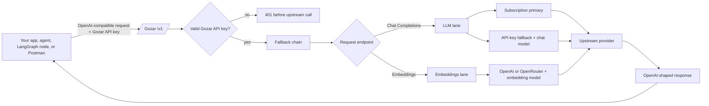
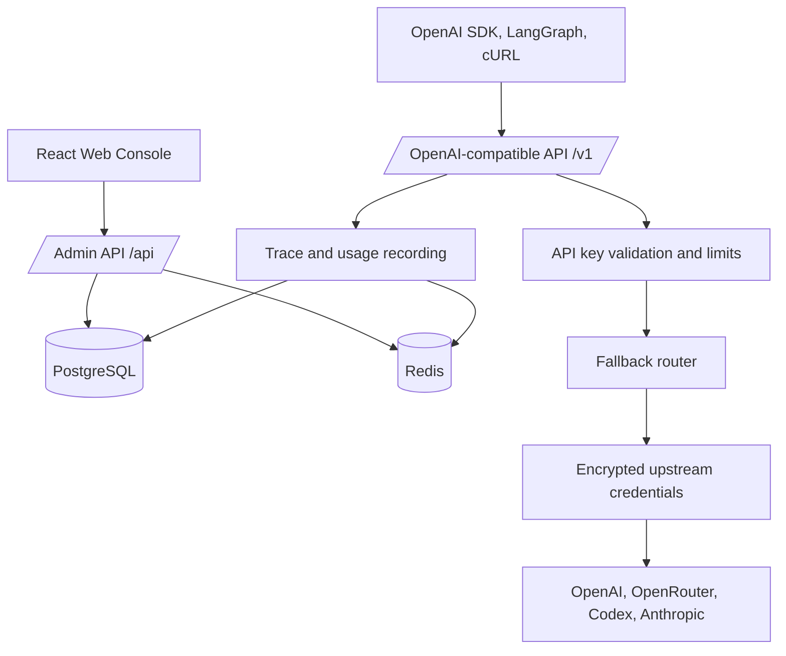

# Gozar

**Gozar is a self-hosted, OpenAI-compatible LLM gateway for local projects, private
teams, and developer workflows.** Applications use one stable `/v1` endpoint and a
Gozar API key while the gateway routes requests through operator-managed upstream
accounts, provider API keys, and fallback chains.

Use Gozar when you want a private, Docker-first, OpenAI-compatible proxy that can be
used from the OpenAI SDK, LangChain, LangGraph, Postman, cURL, internal tools, local
agents, and project-specific backends without rewriting every client integration.

> Current release: `0.1.0`. Gozar is source-available under the PolyForm
> Noncommercial License 1.0.0 and is intended for self-hosted, non-commercial use.

[](LICENSE)


## Why Gozar?

Developers often need a local or self-hosted LLM gateway that behaves like the
OpenAI API but still lets them control routing, credentials, limits, traces, and
fallbacks. Gozar gives every project a single `/v1` endpoint and a per-project Gozar
API key, while the operator manages upstream credentials in one place.

## What You Get

- **Drop-in OpenAI compatibility** - use `/v1/chat/completions`, `/v1/embeddings`,
  streaming SSE, and `/v1/models` with standard OpenAI-style shapes.
- **One API key per app or workflow** - issue Gozar API keys for each local project,
  agent, backend service, or team integration.
- **Bring your own upstream access** - connect API-key providers such as OpenAI and
  OpenRouter, plus subscription providers such as Codex and Anthropic where
  supported by the deployment.
- **Codex device-code sign-in** - Codex subscription connect does not depend on a
  broken `localhost` redirect. Gozar shows a one-time code and completes the account
  connection after OpenAI approval.
- **Two-lane fallback chains** - one chain ID contains an LLM lane and an Embeddings
  lane. Every node selects its own account, model, and fallback policy.
- **Chain health alerts** - saved routes are rechecked against current account
  status and model catalogs; removed models and unavailable accounts are surfaced
  before they become silent production failures.
- **Route-aware model discovery** - Chat and Embeddings catalogs are discovered,
  cached, and refreshed independently for each API-key account; subscription
  providers can use runtime fallback catalogs.
- **LangChain and LangGraph friendly** - point `ChatOpenAI` at the Gozar `/v1` base
  URL and use the Gozar API key. Chain selection happens inside Gozar.
- **Usage limits, traces, and analytics** - track request volume, token usage,
  per-token activity, per-account activity, and routing outcomes.
- **Secure by default** - encrypted credential storage, fail-closed operator auth,
  secret-free logs, password-confirmed API key reveal, Docker-first deployment, and
  production reverse-proxy guidance.

## Contents

- [How Gozar Works](#how-gozar-works)
- [Quick Start: Run Locally with Docker](#quick-start-run-locally-with-docker)
- [First-Run Setup in the Console](#first-run-setup-in-the-console)
- [Connect Upstream Accounts](#connect-upstream-accounts)
- [Build a Provider-Aware Fallback Chain](#build-a-provider-aware-fallback-chain)
- [Create a Gozar API Key](#create-a-gozar-api-key)
- [Dynamic Chains and Per-Call Overrides](#dynamic-chains-and-per-call-overrides)
- [Use Gozar from Your App](#use-gozar-from-your-app)
- [Model Discovery](#model-discovery)
- [Admin API](#admin-api)
- [Architecture](#architecture)
- [Production Deployment](#production-deployment)
- [Security](#security)
- [Configuration](#configuration)
- [Troubleshooting](#troubleshooting)
- [Development](#development)
- [Contributing and Security](#contributing-and-security)
- [Operator Responsibilities](#operator-responsibilities)
- [Disclaimer](#disclaimer)
- [License](#license)

## How Gozar Works

Gozar has two surfaces:

- **Data path: `/v1`** - the OpenAI-compatible endpoint used by your applications.
  It accepts a Gozar API key, chooses the correct fallback chain, calls an upstream
  provider account, and returns an OpenAI-shaped response.
- **Control path: `/api`** - the authenticated admin API used by the web console for
  accounts, API keys, fallback chains, model catalogs, traces, and analytics.



The client does not need to know which upstream account was used. It only needs:

```text
GOZAR_BASE_URL=https://your-gozar-domain.example/v1
GOZAR_API_KEY=gz-...
GOZAR_MODEL=<a model returned by GET /v1/models>
```

## Quick Start: Run Locally with Docker

This is the fastest way to run Gozar for a local project, internal tool, or private
development environment.

### 1. Clone and configure

Clone or download this repository, open its root directory, then run:

```bash
cp .env.example .env
```

Generate strong secrets and place them in `.env`:

```bash
python3 - <<'PY'
import base64
import secrets

print("GOZAR_MASTER_KEY=" + base64.b64encode(secrets.token_bytes(32)).decode())
print("GOZAR_JWT_SECRET=" + secrets.token_urlsafe(64))
print("GOZAR_TOKEN_PEPPER=" + secrets.token_urlsafe(64))
PY
```

At minimum, these values must be set:

- `GOZAR_MASTER_KEY` - base64-encoded 32-byte key for encrypted credential storage.
- `GOZAR_JWT_SECRET` - signs operator session tokens.
- `GOZAR_TOKEN_PEPPER` - mixed into Gozar API key hashes.
- `POSTGRES_USER`, `POSTGRES_PASSWORD`, `POSTGRES_DB` - database configuration.

Gozar fails closed if required runtime secrets are missing.

### 2. Start the stack

```bash
docker compose up -d --build
```

Local URLs:

- Web console: <http://localhost:5173>
- Backend API: <http://localhost:8000>
- API docs: <http://localhost:8000/docs>
- OpenAPI JSON: <http://localhost:8000/openapi.json>

### 3. Check readiness

```bash
curl http://localhost:8000/health
curl http://localhost:8000/ready
```

Expected ready response:

```json
{"status":"ready"}
```

## First-Run Setup in the Console

On the first visit, Gozar has no administrator account. The console guides you
through first-run bootstrap:

1. Open <http://localhost:5173>.
2. Create the first admin username and password.
3. Sign in.
4. Connect upstream accounts.
5. Build a chain, configure its LLM lane, and add an Embeddings lane when needed.
6. Create a Gozar API key for your app and pin its normal chain.
7. Copy the integration values from the API Keys page or open **Docs**.

The bootstrap endpoint is permanently closed after the first operator exists.

## Connect Upstream Accounts

Open **Accounts** in the web console and choose **Connect account**.

### API-key providers

Use this for providers such as OpenAI or OpenRouter:

1. Select **API key**.
2. Choose the provider.
3. Paste the provider API key.
4. Add an optional label such as `openai-prod` or `openrouter-dev`.
5. Click **Connect**.

Gozar validates the key against a cheap provider model-listing call before storing
it. The stored secret is encrypted at rest.

### Codex subscription accounts

Codex uses device-code sign-in by default. This is the recommended flow because it
does not rely on a `localhost:1455` redirect:

1. Select **Subscription**.
2. Choose **Codex (ChatGPT subscription)**.
3. Click **Start device sign-in**.
4. Open the verification page shown by Gozar.
5. Enter the one-time code.
6. Keep the Gozar dialog open while it checks approval.
7. Gozar completes the account connection automatically.

The manual redirect URL flow is still available through **Use redirect URL** for
OAuth clients that only allow loopback callbacks.

### Anthropic and other subscription providers

Subscription providers that do not expose a device-code flow use the manual OAuth
fallback:

1. Start authorization in Gozar.
2. Open the provider authorization URL.
3. After approval, the browser may land on a non-loading localhost URL.
4. Paste the full callback URL, or just the authorization code, back into Gozar.

## Build a Provider-Aware Fallback Chain

Open **Chains** and create one route with up to two independent lanes:

1. In **LLM**, add the primary Chat account, for example a Codex subscription.
2. Add an LLM fallback such as OpenRouter and select that provider's chat model.
3. In **Embeddings**, add an OpenAI or OpenRouter account and select its embedding
   model. Add more nodes only when embedding fallback is required.
4. Order each lane independently. Gozar stops at the first successful node in the
   lane selected by the request endpoint.
5. Choose when each failed node may continue:
   - `any_error` - continue after any typed provider failure; this preserves the
     original Gozar behavior.
   - `auth_or_retryable` - continue after an upstream `401`/`403`, transport error,
     `429`, or `5xx`.
   - `retryable` - continue only after transport errors, `429`, or `5xx`.
6. Save the route and resolve any health warning shown on the chain or Dashboard.

`POST /v1/chat/completions` always uses the LLM lane. `POST /v1/embeddings` always
uses the Embeddings lane. The client sends no routing-mode flag, and the same Gozar
API key and chain ID work for both endpoints. A missing requested lane fails closed
with `NO_AVAILABLE_ACCOUNT` instead of silently using the wrong provider.

The model on a node is the exact model sent to that provider. Leaving it empty
forwards the inbound request model unchanged and is appropriate only when both
providers accept the same model identifier.

## Create a Gozar API Key

Open **API Keys** in the console.

1. Click **Create API key**.
2. Give it a label like `local-agent`, `backend-dev`, or `langgraph-worker`.
3. Optionally set a usage limit.
4. Optionally pin the key to a fallback chain.
5. Save the new key.

Gozar returns the secret once on creation. You can reveal the same API key again
later after operator password confirmation. Reveal does **not** rotate the key.

Use a Gozar API key in your application instead of exposing upstream provider keys
to every project.

The **Test this route** action uses the selected Gozar API key internally. The
operator does not paste or reveal its secret, and testing never rotates the key.

## Dynamic Chains and Per-Call Overrides

Application traffic should not create database resources inline. Create or update a
stable chain through the authenticated control path, then select that saved chain for
individual LLM calls. `PUT` is idempotent: repeating the same caller-owned key keeps
the same chain UUID and updates its definition instead of creating duplicates.

```bash
curl -X PUT "$GOZAR_ADMIN_BASE_URL/api/chains/by-key/support-production" \
  -H "Authorization: Bearer $GOZAR_ADMIN_SESSION_TOKEN" \
  -H "Content-Type: application/json" \
  -d '{
    "name": "Support production",
    "entries": [
      {
        "account_id": "OPENAI_ACCOUNT_UUID",
        "model": "PRIMARY_CHAT_MODEL_ID",
        "fallback_policy": "auth_or_retryable",
        "route": "chat"
      },
      {
        "account_id": "OPENROUTER_ACCOUNT_UUID",
        "model": "OPENROUTER_CHAT_MODEL_ID",
        "route": "chat"
      },
      {
        "account_id": "OPENROUTER_ACCOUNT_UUID",
        "model": "OPENROUTER_EMBEDDING_MODEL_ID",
        "route": "embeddings"
      }
    ]
  }'
```

Use the returned `chain_id` for one request. Routing precedence is:

1. Per-call chain override.
2. Chain pinned to the Gozar API key.
3. Legacy exact model selector.
4. Legacy catch-all chain.

The override can be sent as `X-Gozar-Chain-ID` or as
`{"gozar":{"chain_id":"..."}}` in SDK `extra_body`. Gozar removes the private
`gozar` field before calling the upstream provider.

## Use Gozar from Your App

The Gozar base URL must include `/v1`.

For local Docker:

```bash
export GOZAR_BASE_URL="http://localhost:8000/v1"
export GOZAR_API_KEY="gz-YOUR_GOZAR_API_KEY"
export GOZAR_MODEL="MODEL_RETURNED_BY_V1_MODELS"
export GOZAR_EMBEDDING_MODEL="PROVIDER_EMBEDDING_MODEL"
export GOZAR_CHAIN_ID="OPTIONAL_CHAIN_UUID"
```

For production:

```bash
export GOZAR_BASE_URL="https://gozar.example.com/v1"
export GOZAR_API_KEY="gz-YOUR_GOZAR_API_KEY"
export GOZAR_MODEL="MODEL_RETURNED_BY_V1_MODELS"
export GOZAR_EMBEDDING_MODEL="PROVIDER_EMBEDDING_MODEL"
export GOZAR_CHAIN_ID="OPTIONAL_CHAIN_UUID"
```

### cURL

```bash
curl "$GOZAR_BASE_URL/chat/completions" \
  -H "Authorization: Bearer $GOZAR_API_KEY" \
  -H "Content-Type: application/json" \
  -d "{
    \"model\": \"$GOZAR_MODEL\",
    \"messages\": [
      {\"role\": \"user\", \"content\": \"Hello from Gozar\"}
    ]
  }"
```

### Streaming

```bash
curl "$GOZAR_BASE_URL/chat/completions" \
  -H "Authorization: Bearer $GOZAR_API_KEY" \
  -H "Content-Type: application/json" \
  -d "{
    \"model\": \"$GOZAR_MODEL\",
    \"messages\": [
      {\"role\": \"user\", \"content\": \"Stream a short answer\"}
    ],
    \"stream\": true
  }"
```

### Embeddings for RAG and vector memory

`POST /v1/embeddings` follows the standard OpenAI request and response contract.
It uses the same Gozar API key, assigned chain, per-call chain override, limits,
usage records, and traces as Chat Completions, but automatically selects the
chain's Embeddings lane.

```bash
curl "$GOZAR_BASE_URL/embeddings" \
  -H "Authorization: Bearer $GOZAR_API_KEY" \
  -H "Content-Type: application/json" \
  -d "{
    \"model\": \"$GOZAR_EMBEDDING_MODEL\",
    \"input\": [\"first document\", \"second document\"],
    \"encoding_format\": \"float\"
  }"
```

Embedding nodes accept only embedding-capable OpenAI or OpenRouter API-key accounts.
Each node may store a different provider model, for example
`text-embedding-3-small` on OpenAI and `openai/text-embedding-3-small` on
OpenRouter. The node model overrides the inbound model for that attempt, so fallback
between providers with different model IDs remains transparent. A blank node model
forwards the caller's model unchanged. Gozar never synthesizes a placeholder vector.

```python
response = client.embeddings.create(
    model=os.environ["GOZAR_EMBEDDING_MODEL"],
    input=["first document", "second document"],
    encoding_format="float",
)

vectors = [item.embedding for item in response.data]
```

See the official [OpenAI Embeddings API](https://developers.openai.com/api/reference/resources/embeddings/methods/create)
and [OpenRouter Embeddings API](https://openrouter.ai/docs/api/reference/embeddings)
for provider model and input details.

### OpenAI Python SDK

```python
import os
from openai import OpenAI

client = OpenAI(
    base_url=os.environ["GOZAR_BASE_URL"],
    api_key=os.environ["GOZAR_API_KEY"],
)

response = client.chat.completions.create(
    model=os.environ["GOZAR_MODEL"],
    messages=[{"role": "user", "content": "Hello from Gozar"}],
    extra_headers={"X-Gozar-Chain-ID": os.environ["GOZAR_CHAIN_ID"]},
)

print(response.choices[0].message.content)
```

### OpenAI JavaScript SDK

```ts
import OpenAI from "openai";

const client = new OpenAI({
  baseURL: process.env.GOZAR_BASE_URL,
  apiKey: process.env.GOZAR_API_KEY,
});

const response = await client.chat.completions.create({
  model: process.env.GOZAR_MODEL ?? "MODEL_RETURNED_BY_V1_MODELS",
  messages: [{ role: "user", content: "Hello from Gozar" }],
});

console.log(response.choices[0]?.message?.content);
```

### LangChain and LangGraph

Use the same `/v1` base URL with `ChatOpenAI`. Your LangGraph node does not need
Gozar-specific routing code; the Gozar API key controls chain selection.

```python
import os
from langchain_openai import ChatOpenAI

llm = ChatOpenAI(
    model=os.environ["GOZAR_MODEL"],
    base_url=os.environ["GOZAR_BASE_URL"],
    api_key=os.environ["GOZAR_API_KEY"],
    default_headers={"X-Gozar-Chain-ID": os.environ["GOZAR_CHAIN_ID"]},
    use_responses_api=False,
)

def llm_node(state):
    return {"messages": [llm.invoke(state["messages"])]}
```

The chain stays below LangGraph: nodes continue to call `llm.invoke()`. To override
through the body instead of a header, pass
`extra_body={"gozar": {"chain_id": "CHAIN_UUID"}}` to `ChatOpenAI`.

### Response compatibility and Gozar metadata

The default `POST /v1/chat/completions` and `POST /v1/embeddings` bodies stay inside
their OpenAI schemas. This is the compatibility contract used by the OpenAI Python
and JavaScript SDKs, LangChain, LangGraph, LangSmith, and other OpenAI-compatible
clients. Gozar does not add private fields to normal responses.

Every successful non-streaming Chat Completions or Embeddings response includes
these HTTP headers:

- `x-request-id` and `x-gozar-trace-id` - the request correlation ID.
- `x-gozar-chain-id` - the effective saved chain on non-streaming success.
- `x-gozar-route` - `chat` or `embeddings`, selected from the request endpoint.
- `x-gozar-node-id` and `x-gozar-node-position` - the selected chain node.
- `x-gozar-provider`, `x-gozar-model`, and `x-gozar-attempt-count` - compact routing
  facts for raw HTTP clients.

The matching Trace stores each attempted node, effective provider model, duration,
fallback decision, sanitized error category/status, selected node, and normalized
token usage. Provider credentials and authorization material are never stored there.

Raw HTTP clients may explicitly request a namespaced body extension on a
non-streaming call:

```json
{
  "model": "MODEL_RETURNED_BY_V1_MODELS",
  "messages": [{"role": "user", "content": "Hello"}],
  "gozar": {"include_metadata": true}
}
```

The response then includes a top-level `gozar` object containing `trace_id` and
client-safe routing attempt data. Internal account IDs and credential labels stay in
the operator trace and are not returned to application API keys. This extension is
opt-in because LangChain's
`ChatOpenAI` intentionally normalizes official OpenAI response fields and does not
guarantee preservation of provider-specific fields. Standard `llm.invoke()` calls
should therefore use `AIMessage.usage_metadata` / `response_metadata` and use the
trace ID or Gozar console for routing diagnostics.

## Model Discovery

Clients can list models through the same OpenAI-compatible `/v1` surface:

```bash
curl "$GOZAR_BASE_URL/models" \
  -H "Authorization: Bearer $GOZAR_API_KEY"
```

Behavior:

- If the Gozar API key is pinned to a fallback chain, `/v1/models` returns models
  reachable through its LLM lane. The admin catalog separately supplies embedding
  model suggestions to every compatible Chain node.
- If the key is not pinned, `/v1/models` returns the deployment's auto-routing model
  catalog.
- API-key providers such as OpenAI and OpenRouter can be queried through their live
  `/models` endpoints and cached per account, because two API keys for the same
  provider may have different model access.
- OpenRouter discovery requests `output_modalities=embeddings` for the Embeddings
  lane. OpenAI's basic model cards do not include endpoint capabilities, so Gozar
  classifies the embedding families in that account's live `/models` result. Chat
  and Embeddings use separate Redis cache entries.
- Providers without a live model-listing endpoint use configured or runtime fallback
  model lists.
- The console rechecks the catalog after the configured cache TTL; model updates and
  chain health changes do not require a backend restart.
- The Chain editor uses a native, mobile-friendly model selector and preselects the
  first currently advertised model. Manual model ID entry remains available only as
  a fallback for private or newly introduced provider models.

Runtime fallback models can be updated without restarting the backend:

```bash
curl "$GOZAR_ADMIN_BASE_URL/api/models/providers/codex" \
  -X PUT \
  -H "Authorization: Bearer $GOZAR_ADMIN_SESSION_TOKEN" \
  -H "Content-Type: application/json" \
  -d '{"models":["gpt-5.5","gpt-5.4-mini"]}'
```

Reset a provider to the environment default:

```bash
curl "$GOZAR_ADMIN_BASE_URL/api/models/providers/codex" \
  -X DELETE \
  -H "Authorization: Bearer $GOZAR_ADMIN_SESSION_TOKEN"
```

## Admin API

The admin API lives under `/api` and requires an operator session, except for login
and first-run bootstrap.

Authenticate:

```bash
curl "$GOZAR_ADMIN_BASE_URL/api/auth/login" \
  -H "Content-Type: application/json" \
  -d '{"username":"admin","password":"YOUR_PASSWORD"}'
```

Use the returned access token:

```text
Authorization: Bearer <operator_access_token>
```

Important routes:

| Area | Routes | Purpose |
| --- | --- | --- |
| Auth | `POST /api/auth/login`, `POST /api/auth/refresh`, `GET\|POST /api/auth/bootstrap` | Operator login and first-run setup |
| Accounts | `GET /api/accounts`, `POST /api/accounts/connect/api-key`, `POST /api/accounts/connect/subscription/device/begin`, `POST /api/accounts/connect/subscription/device/complete`, `POST /api/accounts/connect/subscription/begin`, `POST /api/accounts/connect/subscription/complete` | Connect and manage upstream credentials |
| API keys | `GET /api/tokens`, `POST /api/tokens`, `GET /api/tokens/{id}/models`, `POST /api/tokens/{id}/test`, `POST /api/tokens/{id}/reveal`, `POST /api/tokens/{id}/rotate`, `POST /api/tokens/{id}/revoke` | Issue, inspect, test, reveal, rotate, and revoke Gozar API keys |
| Chains | `GET /api/chains`, `POST /api/chains`, `PUT /api/chains/by-key/{client_key}`, `GET\|PUT /api/chains/{id}`, `DELETE /api/chains/{id}` | Define fallback routing and idempotent code-managed chains |
| Models | `GET /api/models`, `GET\|PUT\|DELETE /api/models/providers/{provider}` | View and update provider model catalogs |
| Traces | `GET /api/traces`, `GET /api/traces/{correlation_id}` | Inspect individual requests |
| Analytics | `GET /api/analytics/system`, `GET /api/analytics/tokens/{id}`, `GET /api/analytics/accounts/{id}` | Usage reports |

See `/docs` for the full OpenAPI schema.

## Architecture

Gozar is a modular monolith: one FastAPI backend, one React console, PostgreSQL for
durable state, and Redis for counters, locks, pending OAuth state, and session
affinity.



Core modules:

- `gozar/auth` - operator login, bootstrap, JWT sessions, RBAC.
- `gozar/accounts` - upstream account connect, encrypted credentials, refresh.
- `gozar/tokens` - Gozar API key creation, reveal, rotation, revocation.
- `gozar/routing` - fallback chains and routing decisions.
- `gozar/gateway` - OpenAI-compatible Chat Completions, Embeddings, and model listing.
- `gozar/translation` - provider-specific request and response adapters.
- `gozar/usage` - metering, traces, and analytics inputs.
- `frontend/` - React + TypeScript admin console.

## Production Deployment

Use `compose.prod.yml` for a self-hosted production deployment. It uses no source
bind mounts, restart policies are enabled, and the backend self-migrates on startup.

```bash
cp .env.example .env
docker compose -f compose.prod.yml up -d --build
```

In production compose:

- backend binds to `127.0.0.1:8000`
- frontend binds to `127.0.0.1:8080`
- PostgreSQL and Redis are internal only
- a public reverse proxy such as Nginx should be the only network entrypoint

Recommended public layout:

```text
client -> HTTPS -> Nginx -> 127.0.0.1:8080  console
                       \-> 127.0.0.1:8000   /api and /v1
```

See [`deploy/nginx/`](deploy/nginx/README.md) for a hardened reverse-proxy example
with TLS, HSTS, security headers, rate limits, SSE-friendly `/v1`, and optional admin
IP allowlisting.

## Configuration

All runtime configuration is environment-driven. Start from `.env.example`.

Required secret material:

| Variable | Purpose |
| --- | --- |
| `GOZAR_MASTER_KEY` | Envelope encryption root key for stored credential material |
| `GOZAR_JWT_SECRET` | Signs operator session tokens |
| `GOZAR_TOKEN_PEPPER` | Mixed into Gozar API key hashes |
| `GOZAR_DATABASE_URL` | Async SQLAlchemy database URL |
| `GOZAR_REDIS_URL` | Redis URL for counters, locks, pending state, and session affinity |

Provider-related configuration:

| Variable | Purpose |
| --- | --- |
| `GOZAR_PROVIDER_BASE_URLS` | JSON map of provider id to upstream base URL |
| `GOZAR_PROVIDER_OAUTH` | JSON map of provider id to OAuth metadata overrides |
| `GOZAR_PROVIDER_MODELS` | JSON map of provider id to fallback model names |
| `GOZAR_PROVIDER_MODELS_CACHE_TTL_SECONDS` | Live model-list cache TTL |

Operational probes:

- `GET /health` - process liveness.
- `GET /ready` - fails closed until runtime requirements are configured.

## Security

- **Encrypted credential storage** - upstream API keys, subscription token bundles,
  and revealable Gozar API keys are AES-256-GCM envelope-encrypted.
- **API key verification without plaintext lookup** - Gozar API keys are verified
  with a non-reversible HMAC plus server-side pepper.
- **Password-confirmed reveal** - existing Gozar API keys can be shown again only
  after operator password confirmation.
- **Fail-closed admin API** - all admin routes require an operator session and RBAC
  permission except login and bootstrap.
- **Secret-free logs and traces** - logs and API responses avoid plaintext provider
  keys, subscription tokens, and Gozar API key secrets.
- **Automatic subscription refresh** - valid refresh tokens are refreshed under a
  per-account lock before or after upstream rejection when possible.
- **Production network isolation** - production compose binds app ports to loopback
  and leaves PostgreSQL/Redis private.

## Troubleshooting

### Should the base URL include `/v1`?

Yes. SDK integrations should use:

```text
https://your-gozar-domain.example/v1
```

Then call `chat/completions` or `models` through the SDK. For raw HTTP, call the full
path such as:

```text
https://your-gozar-domain.example/v1/chat/completions
```

The same base URL is used by SDK `embeddings.create()` calls, which resolve to
`https://your-gozar-domain.example/v1/embeddings`.

### I see `401` from Gozar

The Gozar API key is missing, revoked, disabled, or not active. Use a key that starts
with `gz-...` from the API Keys page, not an upstream OpenAI/OpenRouter key.

### I see `all fallbacks failed`

Gozar authenticated your API key, selected a route, and tried upstream credentials,
but every eligible upstream account failed. Check:

- Accounts page for disabled or reauth-required credentials.
- Chains page for route order and unavailable accounts.
- Traces page for the upstream status and last error.
- Whether the requested model exists in the selected route's model catalog.

### Codex says the upstream token was invalidated

If OpenAI invalidates the upstream Codex session, reconnect the Codex subscription
account from Accounts. Gozar can refresh valid refresh tokens automatically, but a
provider-invalidated login session requires fresh provider authorization.

### The browser opens a localhost callback

For Codex, use **Start device sign-in** in the Subscription tab. That flow does not
require a localhost callback. The redirect URL flow is only a fallback for providers
or OAuth clients that require loopback redirects.

### `/v1/models` is missing a model

For API-key providers, refresh the provider's live model list by waiting for the
cache TTL or selecting **Refresh models** on the Dashboard. Embedding discovery is
independent from the LLM list. For subscription providers without a live listing
endpoint, update the provider fallback list from the Dashboard/Admin API.

### Embeddings returns `NO_AVAILABLE_ACCOUNT`

The selected API key chain has no active node in its Embeddings lane. Open the chain,
select **Embeddings**, and add an OpenAI or OpenRouter API-key account with the exact
embedding model for that provider. The editor normally discovers and selects the
model automatically; if the account advertises no embedding model, reconnect or
refresh that account before using the manual fallback. The LLM lane is intentionally
not reused.

## Development

Backend:

```bash
python3 -m venv .venv
source .venv/bin/activate
python -m pip install -e ".[dev]"
pytest -q
uvicorn gozar.app:app --reload --host 127.0.0.1 --port 8000
```

Frontend:

```bash
cd frontend
npm ci
npm test
npm run build
npm run dev
```

The Vite dev server proxies `/api` and `/v1` to the backend.

## Contributing and Security

Contributions should keep the `/v1` data path OpenAI-compatible, preserve secret-free
logs and traces, include focused tests, and update documentation when behavior changes.
Run the backend and frontend test suites before submitting a change.

Do not publish suspected vulnerabilities, real API keys, subscription tokens,
operator credentials, production `.env` files, database dumps, or trace exports in a
public issue. Use the repository host's private vulnerability-reporting channel when
available. If no private channel exists, contact the maintainer privately before
disclosing details.

## Operator Responsibilities

Gozar does not ship with, broker, or resell provider access. Operators must supply their own subscription accounts and API keys for every upstream provider they connect. Operators are responsible for ensuring their deployment and usage comply with provider terms of service, local laws, organization policy, and applicable data-protection obligations.

## Disclaimer

**This is not legal advice.** The text below is a general disclaimer for a
source-available, self-hosted tool; consult a qualified lawyer for your jurisdiction before
relying on it or publishing the project.

Gozar is provided for self-hosted, non-commercial use. **Responsibility for the use
of this software rests entirely with the Operator who deploys and runs it.** The
authors and contributors bear no legal responsibility for any unlawful use, or for
any use that violates the terms of service of any upstream provider, including but
not limited to OpenAI/Codex and Anthropic. Routing a paid subscription account
through third-party software may breach that provider's terms and can put the account
at risk of suspension; the Operator accepts that risk. The Operator must supply their
own subscription accounts and API keys, is the data controller for all data passing
through their deployment, and is solely responsible for ensuring that their
configuration and usage comply with all applicable laws, regulations, sanctions,
export controls, and provider agreements. The software is provided **AS IS**, without
warranty of any kind, express or implied, and to the maximum extent permitted by law
the authors and contributors shall not be liable for any claim, damages, or other
liability arising from the software or its use.

## License

Gozar is licensed under the **PolyForm Noncommercial License 1.0.0**. It grants you
the right to use, modify, and redistribute the software for any noncommercial purpose,
while prohibiting commercial use. It is a source-available license rather than an
OSI-approved open-source license. See the [LICENSE](LICENSE) file for the full terms.

---

Created by **sina2266**.
